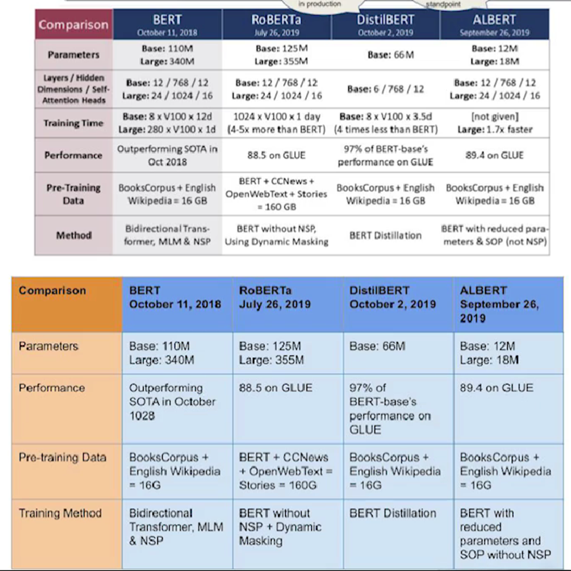

# Bi RNN

<figure><figcaption></figcaption></figure>

\-        Above is a unidirectional RNN or vanilla RNN

**Issues:**

1\.      A regular RNN only looks at past and present input before generating output

This is called as casual network

It cannot look into the future

2\.      .png>)

\-        A regular RNN will go only L to R, so it wont be able to understand the context and may not predict correct output

\-        If we are able to feed the reverse, then we will be knowing the next sequence also

*

    <figure><figcaption></figcaption></figure>

\-        We will be having forward and backward layer

\-        We are getting the feed in both the direction

\-        Once we have the output of both the layers, we will be concatenating the output

\-        For neural machine translation task it is preferable to look ahead at next word before encoding a given word

\-        So all the queens will be having different embeddings

\-        Run 2 RNNs on the same input, one is reading from L to R and another is reading from R to L

\-        Combine the output at each time step by concatenating them

Tf.keras.layers.BiDirectional(tf.keras.layer.GRU(Units))

&#x20;

*

    <figure><figcaption></figcaption></figure>

&#x20;

Can be used inside encoder-decoder architecture

And also for NMT

&#x20;

Encoder à Embeddings à LSTM à Dense

&#x20;

Masking means adding passing like EOS, BOS etc

&#x20;

Libraries to explore:

\-        Ktrain

\-        Pytorch lighning

\-        Hugging face

&#x20;
